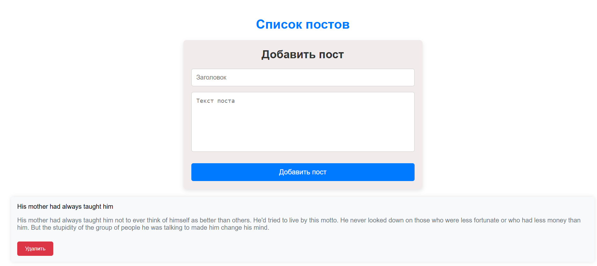
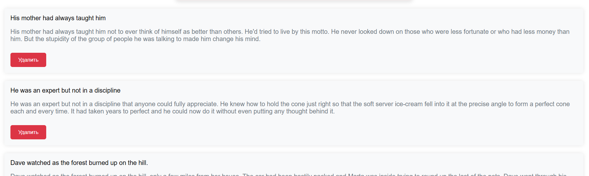
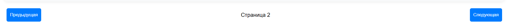

# "Новости"

## Описание проекта

Проект представляет собой одностраничное приложение (SPA), которое позволяет пользователям просматривать, добавлять и удалять посты, получаемые с API https://dummyjson.com/posts. Все данные обрабатываются с помощью GET, POST и DELETE запросов к API, а также используется пагинация для просмотра списка постов.

Кроме того, приложение использует react-toastify для вывода уведомлений об успешных и ошибочных действиях, таких как добавление или удаление постов.

## **App (Главный компонент)**

Компонент, который управляет состоянием приложения, включая данные о постах и состояние текущей страницы пагинации. Он также содержит логику для добавления и удаления постов, а также отображает другие компоненты приложения (форму добавления поста, список постов и компонент пагинации).

## **PostList (Компонент списка постов)**

Этот компонент отображает список всех постов, которые были загружены с API. Каждый пост передается в компонент Post, где он отображается вместе с кнопкой для удаления.

## **Post (Компонент поста)**

Компонент для отображения одного поста. Каждый пост состоит из заголовка, тела текста и кнопки "Удалить". При нажатии на кнопку отправляется DELETE запрос для удаления поста с сервера.

## **PostForm (Форма для добавления поста)**

Компонент формы для добавления нового поста. Использует react-hook-form для управления формой и валидацией. После отправки формы отправляется POST запрос для добавления нового поста на сервер.

## **Pagination (Компонент пагинации)**

Компонент, который отображает кнопки для переключения между страницами списка постов. Состояние текущей страницы хранится в главном компоненте App.

## Технологии

- **React:** Для создания компонентов и управления состоянием.
- **React Hook Form:** Для упрощения работы с формами и валидацией данных.
- **React Bootstrap:** Для удобного стилизования компонентов (формы, карточки, кнопки и т.д.).
- **React Toastify:** Для отображения уведомлений об успешных или ошибочных действиях.
- **Axios:** Для отправки HTTP запросов (GET, POST, DELETE) к серверу.

## Основной функционал

### Получение постов (GET запрос):

Приложение делает запрос на https://dummyjson.com/posts с параметрами limit и skip для получения списка постов с пагинацией.

### Добавление поста (POST запрос):

Пользователь может добавить новый пост, заполнив форму с заголовком и текстом. После отправки формы данные отправляются на сервер с помощью POST запроса на https://dummyjson.com/posts/add.

### Удаление поста (DELETE запрос):

Каждому посту соответствует кнопка "Удалить". При нажатии на кнопку отправляется DELETE запрос на сервер для удаления конкретного поста по ID. После успешного удаления поста обновляется список на странице.

### Пагинация:

Для удобства просмотра большого количества постов реализована пагинация. Пользователи могут переходить между страницами списка постов с помощью кнопок "Предыдущая" и "Следующая".

### Уведомления:

Для удобства пользователей используются уведомления через react-toastify, которые информируют о том, что операция была успешной или возникла ошибка.

